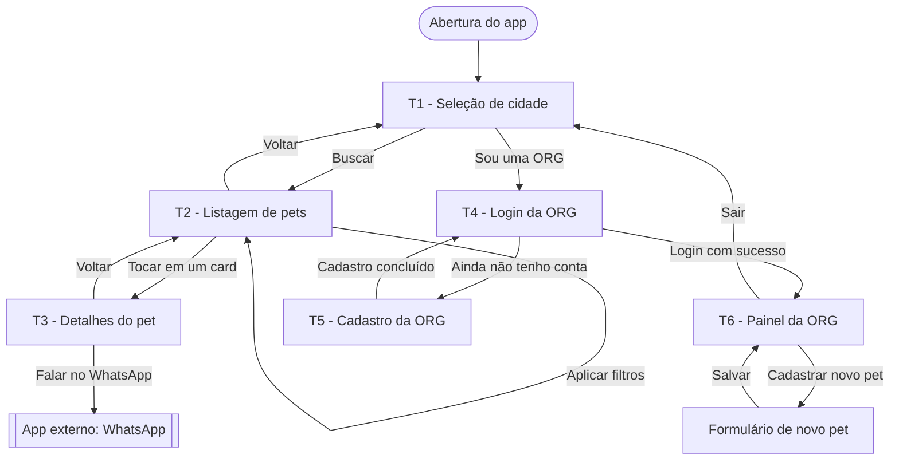

# Proposta e Planejamento da Aplicação Mobile

**Disciplina:** Tópicos em Computação e Sistemas II
**Aluno:** Gabriel Santana
**Etapa:** 01 — Proposta e Planejamento
**Repositório:** https://github.com/gsantanaoffsec/tcs-II-repo

---

## 1. Nome da aplicação

**AdotaAí**

Aplicativo mobile que conecta organizações de resgate animal (ORGs) a pessoas interessadas em adotar um pet.

---

## 2. Problema que a aplicação pretende resolver

A adoção de animais no Brasil ainda acontece majoritariamente por canais informais: posts de Instagram que somem no feed, grupos de WhatsApp desorganizados e feiras de adoção presenciais com alcance limitado a um bairro.

Isso gera três problemas concretos:

- **Para quem quer adotar:** não existe um lugar único onde filtrar animais por cidade e por características (porte, idade, raça). A pessoa depende de sorte e de algoritmo de rede social.
- **Para as ORGs:** o cadastro dos animais fica espalhado em planilhas, álbuns de fotos e conversas. Não há um catálogo próprio e permanente.
- **Para o contato:** mesmo quando o adotante encontra o animal, o caminho até falar com o responsável é confuso — perfil, direct, telefone na bio, resposta em dias.

O AdotaAí centraliza o catálogo, permite filtrar por localização e características, e encurta o contato para um único toque via WhatsApp direto com a ORG responsável.

---

## 3. Público-alvo

**Público primário — adotantes:** pessoas de 18 a 45 anos, usuárias de smartphone, que procuram um animal para adoção e querem filtrar por cidade e por perfil do animal (porte compatível com apartamento, idade, nível de energia).

**Público secundário — organizações:** ONGs, abrigos e protetores independentes que precisam de um canal simples para publicar os animais disponíveis e receber contato de interessados.

---

## 4. Objetivo principal

Permitir que uma pessoa encontre, filtre e entre em contato com organizações responsáveis por animais disponíveis para adoção na sua cidade, e que organizações cadastrem e mantenham esses animais em um catálogo próprio dentro do aplicativo.

---

## 5. Descrição das principais funcionalidades

### Área pública (adotante — não exige login)

| # | Funcionalidade | Descrição |
|---|---|---|
| F01 | Selecionar cidade | A cidade é obrigatória para qualquer busca. Sem cidade, não há listagem. |
| F02 | Listar pets disponíveis | Exibe os animais vinculados a ORGs daquela cidade. |
| F03 | Filtrar por características | Filtros opcionais: idade, porte e raça, aplicados sobre a listagem. |
| F04 | Ver detalhes do pet | Fotos, descrição, características e dados da ORG responsável. |
| F05 | Contatar a ORG | Abre o WhatsApp com o número da ORG já preenchido. |

### Área administrativa (ORG — exige autenticação)

| # | Funcionalidade | Descrição |
|---|---|---|
| F06 | Cadastro de ORG | Nome, e-mail, senha, WhatsApp e endereço completo (CEP, estado, cidade, rua, número). |
| F07 | Login de ORG | Autenticação por e-mail e senha, com emissão de token JWT. |
| F08 | Cadastrar pet | Vincula um novo animal à ORG autenticada. |
| F09 | Listar meus pets | Painel com os animais cadastrados pela própria ORG. |

### Regras de negócio já definidas

- **RN01** — A cidade é obrigatória para listar pets.
- **RN02** — Toda ORG deve possuir endereço e número de WhatsApp.
- **RN03** — Todo pet é obrigatoriamente vinculado a uma ORG.
- **RN04** — O contato do adotante acontece diretamente com a ORG via WhatsApp; o aplicativo não intermedeia a conversa.
- **RN05** — Todos os filtros, exceto a cidade, são opcionais.
- **RN06** — A ORG precisa estar autenticada para acessar a área administrativa.
- **RN07** — A cidade é um dado da ORG, não do pet. Listar pets por cidade significa filtrar o pet por um campo da entidade relacionada.

---

## 6. Telas previstas

O escopo inicial prevê **seis telas**, acima do mínimo de quatro exigido.

| # | Tela | Área | Função |
|---|---|---|---|
| T1 | **Seleção de cidade** (Home) | Pública | Tela de entrada. Define a cidade da busca e leva à listagem. |
| T2 | **Listagem de pets** | Pública | Grid de cards com os animais da cidade e a barra de filtros. |
| T3 | **Detalhes do pet** | Pública | Fotos, descrição, características e o botão de contato via WhatsApp. |
| T4 | **Login da ORG** | Autenticação | E-mail e senha. Porta de entrada da área administrativa. |
| T5 | **Cadastro da ORG** | Autenticação | Formulário de criação da conta da organização. |
| T6 | **Painel da ORG** | Administrativa | Lista os pets da própria ORG e dá acesso ao formulário de cadastro de um novo pet. |

---

## 7. Fluxo básico de navegação



**Descrição em texto:**

O aplicativo abre na **T1 (Seleção de cidade)**. A partir dela existem dois caminhos independentes:

1. **Fluxo do adotante:** T1 → T2 (listagem filtrada pela cidade) → T3 (detalhes) → WhatsApp externo. Todo o fluxo funciona sem autenticação.
2. **Fluxo da ORG:** T1 → T4 (login) → T6 (painel). Quem ainda não tem conta desvia para T5 (cadastro) e retorna para T4. O acesso a T6 é protegido por token; sem token válido, o app redireciona de volta para T4.

---

## 8. Tecnologia escolhida para o desenvolvimento mobile

**React Native com Expo (SDK atual) e TypeScript.**

Justificativa técnica:

- **Reaproveitamento de linguagem.** O backend do projeto é escrito em TypeScript. Usar React Native mantém uma única linguagem no app e na API, o que permite compartilhar tipos, schemas de validação (Zod) e convenções entre as duas pontas. Flutter exigiria manter Dart no app e TypeScript no servidor, com duplicação de modelos.
- **Expo reduz a fricção de build.** O desenvolvimento acontece em duas máquinas diferentes (Windows e macOS). O Expo permite rodar e testar o app em ambas sem configurar Android Studio e Xcode nativamente em cada uma, o que é decisivo para a continuidade do projeto ao longo do semestre.
- **Curva de aprendizado compatível com o prazo.** O ecossistema React já é conhecido; a disciplina tem duração limitada e aprender Dart do zero consumiria tempo que deve ir para a construção da aplicação em si.

Bibliotecas previstas para o app:

| Biblioteca | Papel |
|---|---|
| Expo Router | Navegação baseada em arquivos (file-based routing) |
| Axios | Cliente HTTP para consumo da API |
| TanStack Query | Cache e sincronização do estado vindo do servidor |
| Zod | Validação dos formulários de cadastro e login |
| Expo SecureStore | Armazenamento seguro do token JWT no dispositivo |
| Expo Linking | Abertura do WhatsApp a partir da tela de detalhes |

---

## 9. Tecnologia escolhida para o backend

**Node.js com Fastify, em TypeScript.**

| Camada | Tecnologia |
|---|---|
| Runtime | Node.js 24 LTS |
| Framework HTTP | Fastify 5 |
| ORM | Prisma 6 |
| Banco de dados | PostgreSQL 16 (em container Docker) |
| Validação | Zod 4 |
| Autenticação | `@fastify/jwt` com hash de senha via bcryptjs |
| Testes | Vitest 3 (unitários) e Supertest (end-to-end) |

Justificativa técnica:

- A API segue arquitetura em camadas com **inversão de dependência**: os *use cases* dependem de interfaces de repositório, não de implementações concretas. Isso permite usar repositórios em memória nos testes unitários e repositórios Prisma em produção, sem alterar a regra de negócio.
- O Fastify tem sobrecarga menor que o Express e validação de schema integrada, o que reduz código de checagem manual nos controllers.
- O Prisma foi fixado na versão 6 de forma deliberada: a 7 introduz mudanças simultâneas em generator, driver adapter e resolução de módulos que não trazem ganho para o escopo deste projeto.

---

## 10. Necessidade de comunicação com APIs externas

**Sim**, em dois pontos, ambos com finalidade bem delimitada:

| API externa | Uso | Obrigatória? |
|---|---|---|
| **WhatsApp (deep link `wa.me`)** | Abrir a conversa com a ORG a partir da tela de detalhes do pet, com o número já preenchido. É um deep link, não uma integração autenticada. | Sim — sustenta a RN04 |
| **ViaCEP** | Preencher automaticamente estado, cidade e rua no cadastro da ORG a partir do CEP informado, reduzindo erro de digitação em um dado que é chave para a busca. | Não — melhoria de usabilidade |

Não está previsto o uso de serviços pagos, gateways de pagamento ou APIs de mapas nesta fase. Caso o upload de fotos de pets exija armazenamento externo em etapas futuras, a decisão será documentada e justificada.

---

## 11. Forma prevista de armazenamento de dados

O armazenamento acontece em **duas camadas distintas**, com responsabilidades separadas:

### Servidor — dado persistente e compartilhado

**PostgreSQL 16**, executado em container Docker, acessado pela API através do Prisma. É a fonte da verdade: todo dado que precisa ser visto por mais de um usuário mora aqui.

Entidades do schema inicial:

- **Org** — `id`, `name`, `email`, `phone`, `password_hash`, `cep`, `state`, `city`, `street`, `st_number`, `created_at`, e a relação `pets`.
- **Pet** — `id`, `name`, `description`, `breed`, `age`, `size`, `created_at`, e a relação `org` através de `org_id`.

A evolução do schema é controlada por **migrations do Prisma**, versionadas no repositório. Isso significa que o código e a estrutura do banco viajam juntos no Git; os **dados**, não — cada máquina que clonar o projeto sobe o próprio container e aplica as migrations sobre um banco vazio.

### Dispositivo — dado local da sessão

- **Expo SecureStore:** armazenamento do token JWT da ORG autenticada, em área criptografada do sistema operacional (Keychain no iOS, Keystore no Android). Senha nunca é armazenada no dispositivo.
- **AsyncStorage:** dados não sensíveis de conveniência, como a última cidade pesquisada.
- **Cache do TanStack Query:** cache em memória das respostas da API durante a sessão, para evitar requisições repetidas ao trocar de tela.

---

## 12. Repositório Git

**https://github.com/gsantanaoffsec/tcs-II-repo**

Convenções adotadas:

- Entrega de cada etapa marcada por **tag anotada** (`etapa-01`, `etapa-02`, ...).
- Mensagens de commit no padrão **Conventional Commits** (`feat:`, `docs:`, `fix:`, `chore:`).
- Documentação de cada etapa em `/docs`.

---

## 13. Estrutura inicial de diretórios

```
tcs-II-repo/
├── docs/
│   └── proposta.md              # este documento
│
├── app/                         # aplicação mobile — React Native + Expo
│   ├── src/
│   │   ├── app/                 # rotas (Expo Router — file-based routing)
│   │   │   ├── (public)/
│   │   │   │   ├── index.tsx           # T1 - seleção de cidade
│   │   │   │   ├── pets/index.tsx      # T2 - listagem
│   │   │   │   └── pets/[id].tsx       # T3 - detalhes
│   │   │   ├── (auth)/
│   │   │   │   ├── sign-in.tsx         # T4 - login da ORG
│   │   │   │   └── sign-up.tsx         # T5 - cadastro da ORG
│   │   │   ├── (org)/
│   │   │   │   ├── dashboard.tsx       # T6 - painel da ORG
│   │   │   │   └── pets/new.tsx        # formulário de novo pet
│   │   │   └── _layout.tsx             # layout raiz e providers
│   │   ├── components/          # componentes reutilizáveis de UI
│   │   ├── contexts/            # contexto de autenticação
│   │   ├── hooks/               # hooks customizados
│   │   ├── services/            # funções de chamada à API
│   │   ├── lib/                 # axios, query client, secure store
│   │   └── theme/               # cores, tipografia e espaçamentos
│   ├── assets/
│   ├── app.json
│   ├── package.json
│   └── tsconfig.json
│
├── api/                         # backend — Node.js + Fastify
│   ├── prisma/
│   │   ├── migrations/
│   │   └── schema.prisma
│   ├── src/
│   │   ├── http/
│   │   │   ├── controllers/     # orgs/ e pets/
│   │   │   └── middlewares/     # verificação de JWT
│   │   ├── use-cases/           # regras de negócio
│   │   │   ├── errors/
│   │   │   └── factories/       # montagem das dependências
│   │   ├── repositories/
│   │   │   ├── in-memory/       # implementações para teste
│   │   │   └── prisma/          # implementações de produção
│   │   ├── env/                 # validação das variáveis de ambiente
│   │   ├── lib/
│   │   ├── app.ts
│   │   └── server.ts
│   ├── docker-compose.yml
│   ├── package.json
│   └── tsconfig.json
│
├── .gitignore
└── README.md
```

**Racional da organização:**

- A separação `app/` e `api/` mantém as duas aplicações no mesmo repositório, com `package.json` independentes. Cada uma roda e é instalada isoladamente.
- Dentro de `api/src`, a divisão em `http`, `use-cases` e `repositories` reflete a inversão de dependência: o `use-case` conhece a *interface* do repositório; a *implementação* é escolhida na `factory`. É o que permite trocar o repositório Prisma por um em memória durante os testes sem tocar na regra de negócio.
- Dentro de `app/src/app`, os grupos `(public)`, `(auth)` e `(org)` refletem os três níveis de acesso do fluxo de navegação descrito no item 7.

---

## Observações finais

Esta proposta serve como referência para as etapas seguintes da disciplina. Ajustes de escopo, de tecnologia ou de modelagem poderão ocorrer ao longo do semestre e serão registrados em `/docs`, acompanhados da respectiva justificativa técnica.
